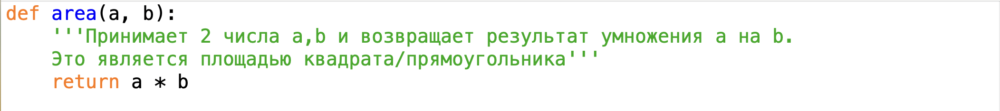
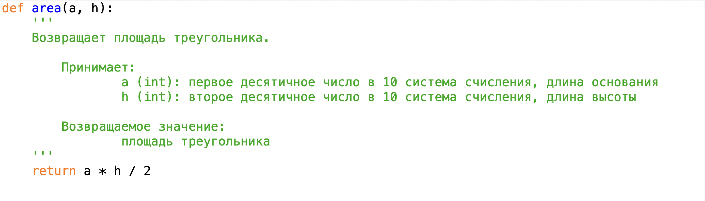
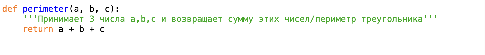
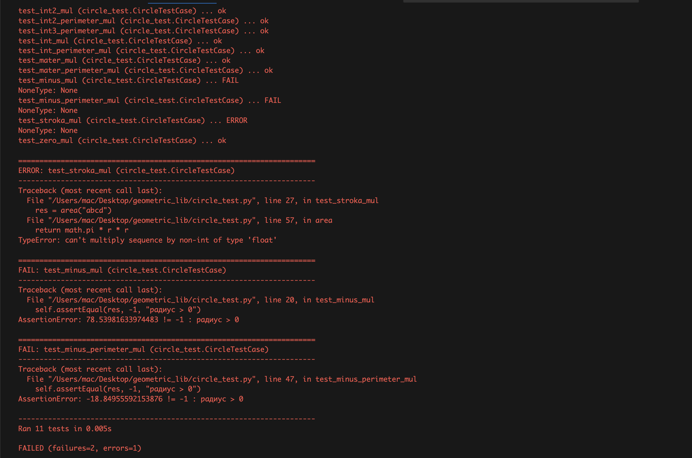
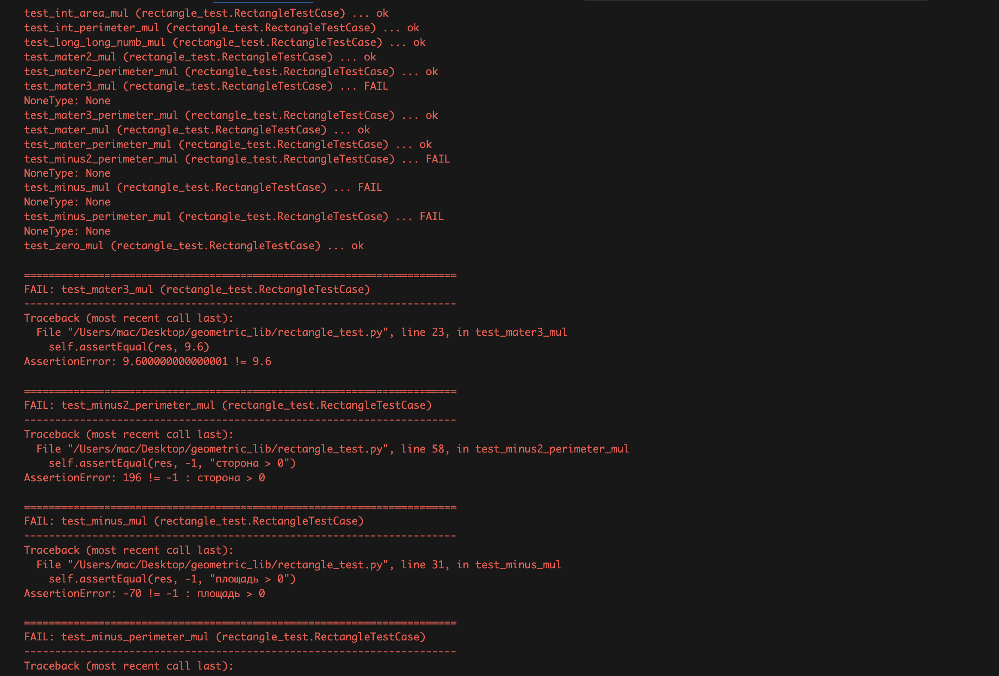
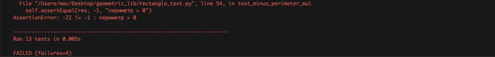

# Documentation

### ___Общее описание решения___
Во второй лабораторной работе я склонировал папку из своего форкнутого репозитория и работал с ней. Для начала была создана новая ветка "documentation_408738" для внесения новых изменений. 

Далее:
1. В среде разработке IDLE добавил описание каждой функции в файлах rectangle.py и triangle.py
2. После каждого комментария делал новый коммит с правильной [семантикой коммитов](https://gist.github.com/joshbuchea/6f47e86d2510bce28f8e7f42ae84c716)
3. Чтобы воспользоваться редактирование файла readme.md установил расширение Markdown в VScode 
4. Для просмотра коммитов вписал в терминал команду git log --stat --graph
5. Запушил к себе в репозиторий все изменения, включая изменения в readme.md


---
### ___Описание функций с примерами вызова___

#### В программах были использованы следующие формулы:
**Area**
- Circle: S = πR²
- Rectangle: S = ab
- Square: S = a²

**Perimeter**
- Circle: P = 2πR
- Rectangle: P = 2a + 2b
- Square: P = 4a

ㅤ
#### В программах были использованы следующие функции:
1. **rectangle.py**
- area(a, b) 


``` 
    cin: 4 6
    cout: 24
```


- perimeter(a, b):


```
    cin: 5 3
    cout: 16
```


2. **triangle.py** 
- area(a, h)


```
    cin: 6 6
    cout: 18
```


- perimeter(a, b, c)


```
    cin: 2 5 9
    cout: 16
```


---
### ___История изменения проекта с хешами комитов (кроме последней записи)___

__Сommit e1829c46b57a7e85da9c462ab3af5d14fa5da77b__
Author: Максим Капленков <mkkaplenkov@gmail.com> 
Date:   Thu Sep 29 17:39:51 2023 +0300
>   Message: ALL all changes to the files have been added

__Сommit e38e2d6921ebea6d11299dd97dc32a178c94d27e__
Author: Максим Капленков <mkkaplenkov@gmail.com> 
Date:   Thu Sep 29 17:31:32 2023 +0300
>   Message: docs: all changes to the files have been added

__Сommit745a958300e8ce18a2cc9ede7b773b1e735cd337__
Author: Максим Капленков <mkkaplenkov@gmail.com> 
Date:   Thu Sep 29 16:42:02 2023 +0300
>   Message: foto add

__Сommit d2a720b7f7cdb7f25897f89049a3ddb10c7267f2__
Author: Максим Капленков <mkkaplenkov@gmail.com> 
Date:   Thu Sep 28 15:29:28 2023 +0300
>   Message: docs: triangle.py <perimeter>


__Сommit befe3e7bdebbaaca6c82b294ce0ade63963cfba8__
Author: Максим Капленков <mkkaplenkov@gmail.com> 
Date:   Thu Sep 28 15:24:04 2023 +0300
>   Message: docs: triangle.py <area>


__Сommit: 7bbc79f2dde230148fcfdc51f6e94177afbf6c78__
Author: Максим Капленков <mkkaplenkov@gmail.com>
Date:   Thu Sep 28 15:17:24 2023 +0300
>   Message: docs: rectangle.py <perimeter>


__Сommit: 1979cc12de21e2020320da667dc3e4c4b542dd9c__
Author: Максим Капленков <mkkaplenkov@gmail.com>
Date:   Thu Sep 28 15:13:49 2023 +0300
>   Message: docs: rectangle.py <area>

__Сommit: 6d86a262a8267e7648f0865526212a833edf7f35__
Author: Максим Капленков <mkkaplenkov@gmail.com>
Date:   Thu Sep 14 21:04:30 2023 +0300
>   Message: the error has been fixed


__Сommit: 232b9cc2d7c3114a0daff7829385eb16be4772f1__
Author: Максим Капленков <mkkaplenkov@gmail.com>
Date:   Thu Sep 14 21:01:22 2023 +0300
>   Message: Added new file


__Сommit: d078c8d9ee6155f3cb0e577d28d337b791de28e2__
Author: smartiqa <info@smartiqa.ru>
Date:   Thu Mar 4 14:55:29 2021 +0300
>   Message: L-03: Docs added


__Сommit: 8ba9aeb3cea847b63a91ac378a2a6db758682460__
Author: smartiqa <info@smartiqa.ru>
Date:   Thu Mar 4 14:54:08 2021 +0300
>   Message: L-03: Circle and square added


---
### ___Unit-tests___

**circle.py**



***Результат:***
____всего 11 тестов, 2 теста с ошибкой, 1 тест не запустился с вохдными данными string, 8 тестов успешно____

#### Успешно :+1::
- `area()`
``` 
    cin: 0
    cout: 0
```
``` 
    cin: 5
    cout: 78.53981633974483
```
``` 
    cin: 14
    cout: 615.7521601035994
```
``` 
    cin: 6.6
    cout: 136.8477759903714
```

- `perimeter()`
``` 
    cin: 3
    cout: 18.84955592153876
```
``` 
    cin: 120
    cout: 753.9822368615503
```
``` 
    cin: 1000000
    cout: 6283185.307179586
```
``` 
    cin: 8.981
    cout: 56.42928724377986
```


#### С ошибкой :-1::
- `area()`
``` 
    cin: -5
    cout: 78.53981633974483 (ожидалось -1, ошибка)
```
``` 
    cin: "abcd"
    cout: error (ожидалось -1)
```


- `perimeter()`
``` 
    cin: -3
    cout: -18.84955592153876 (ожидалось -1, ошибка)
```


**rectangle.py**



***Результат:***
____всего 13 тестов, 4 теста с ошибкой, 9 тестов успешно____

#### Успешно :+1::
- `area()`
``` 
    cin: 10 0
    cout: 0
```
``` 
    cin: 34 12
    cout: 408
```
``` 
    cin: 15.5 3.5
    cout: 54.25
```
``` 
    cin: 5.45 5.88
    cout: 32.046
```
``` 
    cin: 1000000000000000000 5000000000000000000
    cout: 5000000000000000000000000000000000000
```

- `perimeter()`
``` 
    cin: 6 5
    cout: 22
```
``` 
    cin: 6 5.9
    cout: 23.8
```
``` 
    cin: 1.6 14.8300
    cout: 32.86
```
``` 
    cin: 1, 0.00004225
    cout: 2.0000845
```


#### С ошибкой :-1::
- `area()`
``` 
    cin: 1.6 6
    cout: 9.600000000000001 (ожидалось 9.6)
```
``` 
    cin: -14 5
    cout: -70 (ожидалось -1, ошибка)
```

- `perimeter()`
``` 
    cin: -1 -10
    cout: -22 (ожидалось -1, ошибка)
```
``` 
    cin: -2 100
    cout: 196 (ожидалось -1, ошибка)
```


**square.py**


**triangle.py**
